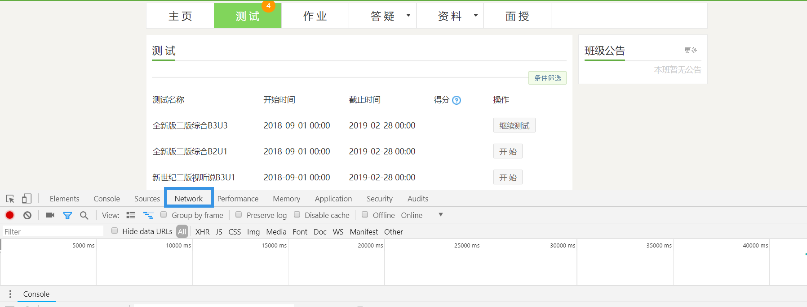
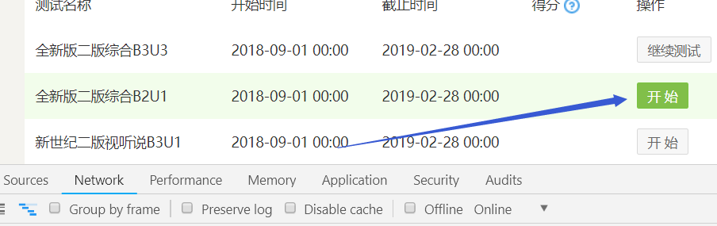
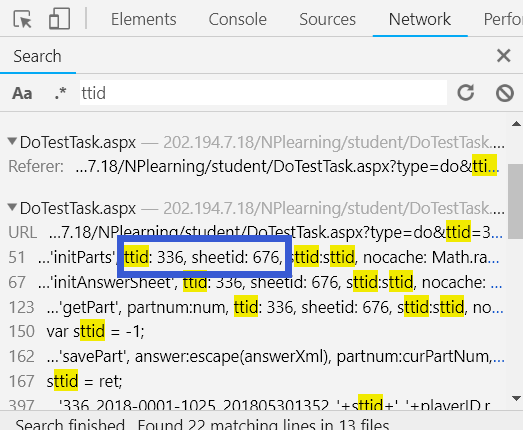
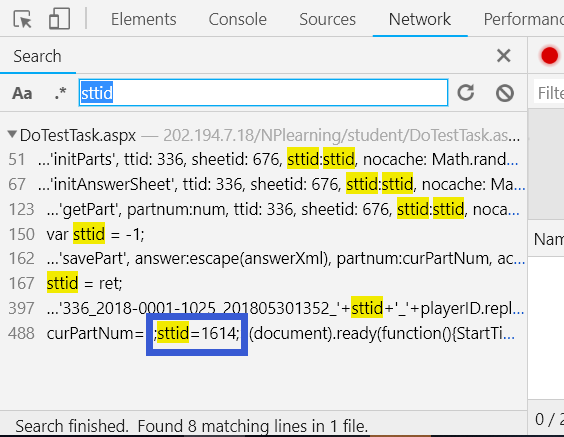
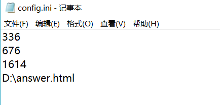
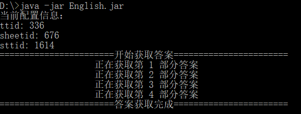

# 新理念外语网络教学答案获取
## 使用方法
- 打开测试界面，按 `F12` 打开开发者工具，然后切换到 `Network` 选项卡



- 找到要获取答案的试题，点击 `开始` 或 `继续测试`


- 在开发者工具栏中按 `CTRL+F`，搜索以下内容：`ttid`，`sheetid`，`sttid`，并记住他们的值  






- 打开配置文件 `config.ini`，将 `ttid`，`sheetid`，`sttid` 的值填入（每行一个），最后一行是答案保存的位置



- 执行脚本
```java
java -jar English.jar
```




- 在配置的答案保存位置处找到答案


